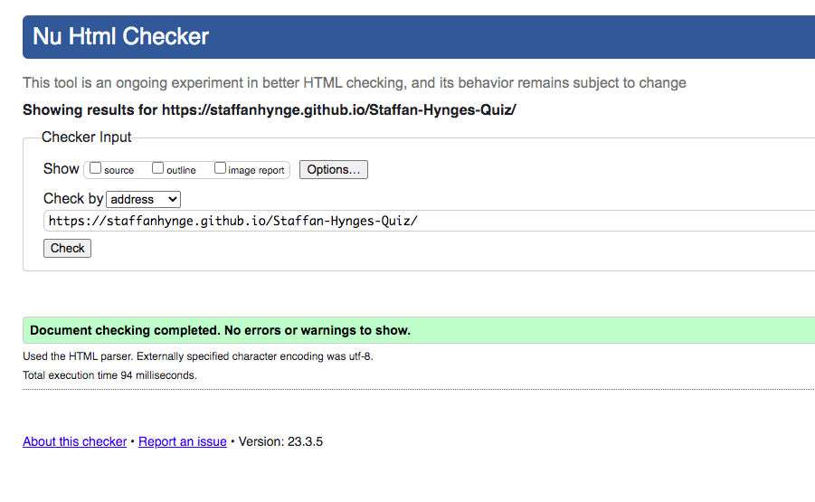

# Popcorn | Trivia 

Popcorn|Trivia is multiple choice quiz about music, movies and entertintment  
Enjoy and good luck

## Features: 

### Header
* A title for what the game is called.

### Startbutton
* A button for you to start the game. 

### Answer grid
* You can choose 4 different answers for each question. Hope you pick the right one. 

### The footer section
* A footer section that shows that this is a project for code Institiute

### Next-button
* A button that makes you go to the next question.

### Scorearea 
* An area that shows you hos many correct or wrong answers you are having.

### Restartbutton 
* A button for you to restart the game. It shows after the last question

## Testing
* I confirmed that this project is responsive and functions on all standard screen sizes using the devtools device toolbar.
* I confirmed that the heading, about text, social media links and contact text are readable and functional.
* I tested that the website works on different browsers: Safari, Firefox, Chrome.

## Validator testing
### HTML 
* No errors were found 

### CSS
* No errors were found 

### Accessibility
* I confirmed that the fonts and colors are easy to read and accessible using the lighthouse tool in Devtools.

## Credits

### Content
* I have learned how to practice a lot of my code, like the hover effects from the modules of [Code Institute](https://codeinstitute.net/)

* I have learned a lot of different techniques and functions in javscript from tutorials here
    * https://www.youtube.com/@WebDevSimplified
    * https://www.youtube.com/@briandesign
    * https://www.youtube.com/@CodeExplained
 

* I also want to thank my mentor for the support on this project.

## Media

* I have not used any icons, images or fonts from another source. 

## Deployment
### The site was deployed to GitHub pages. The steps to deploy are as follows:
 * In the GitHub repository, navigate to the Settings tab  
 * From the source section drop-down menu, select the main Branch
 * Once the main branch has been selected, press save and the page will be refreshed with a detailed ribbon display to indicate the successful deployment.
 * The live link can be found here -  https://staffanhynge.github.io/Staffan-Hynges-Quiz/
